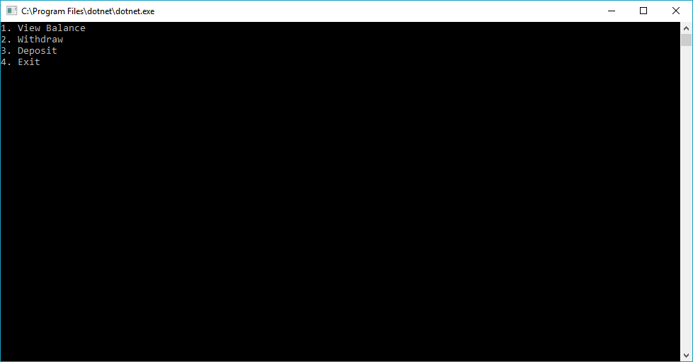

# LAB02-Unit_Testing

## Context

This Lab is an exercise in utilizing Unit testing, documentation, try/catch, and programming fundamentals in C#.
The user is able to interact with a virtual "ATM" via console line interface.

## Visuals

## Usage

-Clone this repository to your local machine.

-Open code .sln file in visual studio.

-In the top menu, Click Debug > Start Without Debugging

-Interact with program via console line interface.

-Experiment with responses and input values